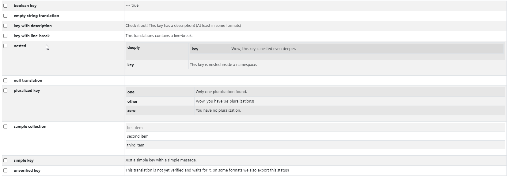

<!-- markdownlint-configure-file {
  "MD013": {
    "code_blocks": false,
    "tables": false
  },
  "MD033": false,
  "MD041": false
} -->

<div align="center">

# react-json-to-html-table
  
  react-json-to-html-table is a small react component that convert **any valid JSON** array or object into an HTML table with some useful added feautures.
  No need to define Columns or Rows!

  [Installation](#installation) •
[Examples](#Examples) •
  [Props](#Props) •
[Storybook](#Storybook) 
</div>

## Installation
  
  

```sh
npm i react-json-to-html-table
```


## Examples
# Basic

```sh
import React from "react";
import ReactDOM from "react-dom";
import HtmlJsonTable from "react-json-to-html-table"
import "bootstrap/dist/css/bootstrap.min.css";


function MyTable() {
const data = {
  boolean_key: "--- true\n",
  empty_string_translation: "",
  key_with_description: "Check it out! This key has a description! (At least in some formats)",
  "key_with_line-break": "This translations contains\na line-break.",
  nested: {
    deeply: {
      key: "Wow, this key is nested even deeper.",
    },
    key: "This key is nested inside a namespace.",
  },
  null_translation: null,
  pluralized_key: {
    one: "Only one pluralization found.",
    other: "Wow, you have %s pluralizations!",
    zero: "You have no pluralization.",
  },
  sample_collection: ["first item", "second item", "third item"],
  simple_key: "Just a simple key with a simple message.",
  unverified_key: "This translation is not yet verified and waits for it. (In some formats we also export this status)",
};

return (
  <HtmlJsonTable data={data} className="table table-sm table-striped table-bordered table-responsive"/>
)}
```
# Select

```sh
import React from "react";
import ReactDOM from "react-dom";
import HtmlJsonTable from "react-json-to-html-table"
import "bootstrap/dist/css/bootstrap.min.css";


function MyTable() {
const data = {
  boolean_key: "--- true\n",
  empty_string_translation: "",
  key_with_description: "Check it out! This key has a description! (At least in some formats)",
  "key_with_line-break": "This translations contains\na line-break.",
  nested: {
    deeply: {
      key: "Wow, this key is nested even deeper.",
    },
    key: "This key is nested inside a namespace.",
  },
  null_translation: null,
  pluralized_key: {
    one: "Only one pluralization found.",
    other: "Wow, you have %s pluralizations!",
    zero: "You have no pluralization.",
  },
  sample_collection: ["first item", "second item", "third item"],
  simple_key: "Just a simple key with a simple message.",
  unverified_key: "This translation is not yet verified and waits for it. (In some formats we also export this status)",
};

function Onselect(event, key, value, keyValue, selected) {
  console.log("Onselect selected", selected);
  console.log("Onselect keyValue", keyValue);
  console.log("Onselect key", key);
  console.log("Onselect value", value);
}

return (
  <HtmlJsonTable data={data} Onselect={Onselect} className="table table-sm table-striped table-bordered table-responsive"/>
)}
```



## Props

| Name               | Description                                 |Type| Returns | Required                     |
| ------------------ | --------------------------------------------|--| ----------|---------------- |
|data                | Data to be displayed in table               |   any valid JSON Object or Array|    -      |true |
| className          | className used in table<br>it can be a bootstrap class or your own class|      string |    -   | false |
| onClickKey         | get Key information on click                               |Function |  event, rowKey, rowValue     |false         |
| onClickValue         | get Value information on click                               |Function |  event, rowValue      |false         |
| Onselect         | Makes table rows selectable                              |Function |     event, key, value, keyValue, selected      |false         |
| OnselectAll         | Makes table rows selectable with select all checkbox   |Function |   event, allSelected     |false         |
| singleSelect        | Makes table only one row selectable with radio checkbox|bool | event, key, value, keyValue, selected|false         |
| HeaderText         | Insert a table Header                               |string |         -            |false         |
| HeaderStyle         | Header stile (react css inline)             |css inline |             -        |false         |
## Storybook
```sh
start-storybook -p 6006
```
